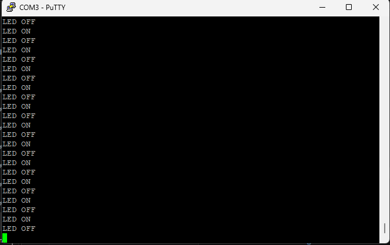

# Evidence - Task 3 Timer Module

## UART Evidence

### Serial Terminal Output

The application was executed on the VSDSquadron Mini board and monitored using PuTTY through the WCH-Link Serial interface at 115200 baud.

**Sample Output:**

```text
LED ON
LED OFF
LED ON
LED OFF
LED ON
LED OFF
LED ON
LED OFF
LED ON
LED OFF
LED ON
LED OFF
```

**Screenshot:**


---

## Hardware Evidence

### LED Blinking Demonstration

The external LED was connected to PD4 through a current-limiting resistor and programmed to blink at 500 ms intervals using the custom timer library.

**Hardware Setup:**

* VSDSquadron Mini Development Board
* External LED
* 220Ω Resistor
* Breadboard and Jumper Wires

**Photo:**


* VSDSquadron Mini board
* Breadboard
* External LED
* Wiring connections

**Video:**
<video controls src="WhatsApp Video 2026-06-18 at 21.39.42.mp4" title="hardware implemented vid"></video>

---

## Application Verification

### How the Application Uses the Library

The application uses the custom timer library through the following APIs:

* `timer_init()` initializes the timer subsystem.
* `timer_delay_ms()` generates 500 ms delays between LED state changes.
* `timer_get_tick()` provides access to the system tick counter.

The main application calls these APIs to create a periodic LED blinking pattern and generate UART status messages.

---

## Hardware Verification

The following functionality was verified on actual hardware:

1. Timer library initialization completed successfully.
2. PD4 GPIO was configured as an output pin.
3. External LED blinked continuously at approximately 500 ms intervals.
4. UART communication operated correctly at 115200 baud.
5. Status messages were transmitted and received successfully through PuTTY.
6. The timer library generated stable delays for periodic execution.

### Verification Result

✅ Timer library functioning correctly

✅ LED blinking verified on hardware

✅ UART output verified through serial terminal

✅ Firmware built, flashed, and executed successfully
